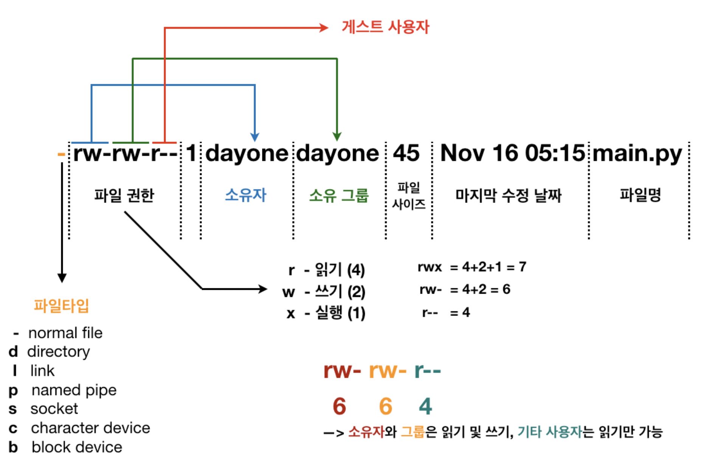

# HTML 기본

## 웹 주소 관련

- (프로토콜) file이라는거는 웹으로 연게 아니라 탐색기로 열었다는 뜻

- 웹서버를 통해 문서를 받기위해 live server를 설치하고 서버를 통해 웹을 열어주면 다음과 같은 주소로 바뀐다. 

- 자기자신을 나타내는 ip주소 127.0.0

- 도메인 주소로 하면 localhost, port번호는 5500 

## html문서의 구조

html문서의 구조는 html안에 head와 body의 영역으로 구성되어있다. 왜 이렇게 나누어져 있는가 하면 head영역은 브라우저에게  주는 정보이고 body영역이 우리가 보는 웹페이지에 표시되는 것을 작성하는 영역이다.

태그는 <></>와 같이 열림태그, 닫힘태그로 구성된다.

## html문서의 작성 규칙

- 대소문자를 구분하지는 않으나 한 쪽으로 쓰는 것을 권장한다. 
- 연속된 공백이나 줄바꿈은 하나의 공백으로 처리된다

~~~ html
<body>
	hello web 										html document       <!--이렇게 작성해도 결과는 아래와 같다-->
</body>
~~~

## 속성

- 태그의 정보를 표현하기 위해 사용

- 태그마다 각 정해진 속성이 있다

~~~ html
<태그명 속성 = '값'>내용</태그명>
~~~

- img태그가 가질 수 있는 속성 

  ~~~ html
       
  <!--title은 이미지에 마우스를 올렸을때(hover)말풍선도움말이 뜬다--> 
  <!--이미지의 테두리, 너비, 높이, 텍스트를 지정한다-->
  ~~~

## 특수문자 처리

~~~ html
<			&lt;
>			&gt;
&			&amp;
#			&num;
공백   &nbsp;
©			&copy;
~~~

## 기본태그

- p태그: paragraph, 단락을 만들때 사용하며 줄을 바꿔주는 기능을 가진 태그이다. 

~~~ html
<body>
   
안녕하세요

   
html

   
test

</body>
<!--쓸때도 줄바꿈을 하는 이유는 사람이 보기 편하게 하기 위함이다. 내용이 많아져 보기 불편할 경우 작성을 위한 줄바꿈은 언제든 해줄 수 있다.-->
~~~

~~~ html
내용이 없을 땐 
로 표기할 수 있다. 이는 올바른 표기법은 아니고 br과 같이 정해진 단일태그를 써야한다
~~~

- br태그: line breaker, 줄바꿈택그이며 단일태그라 열고닫지 않는다

~~~ html
 
~~~

- h태그: heading, 제목을 나타내며 h뒤로 1부터 6까지의 숫자가 붙는데 제목 크기를 지정한다.

~~~ html
<h1>제목입니다</h1>
~~~

- img태그: 이미지를 나타내기위한 태그
  - 사용할 이미지를 가져온다
  - src속성에 경로를 적는데 경로의 기준은 html문서가 있는 위치가 기준이 된다. 같은 위치에 있으면 상대경로를 줄 수가 있다
  - alter속성은 이미지가 나타나지 않을때 대체할 텍스트값을 갖는다.

~~~ html

~~~

- hr태그: 수평선을 그어준다

~~~ html

~~~

- pre태그: 공백, 특수문자, 줄바꿈 등도 입력한 그대로 화면에 표시할 수 있게 해주는 태그다

~~~ html
<pre>
  ### 풀스택 개발자를 위한 웹 프로그래밍 ###
      	HTML5 & CSS3 & JavaScript & JQuery
 	< 가격 : 35,000원 >
</pre>
<!-- 다음을 실행하면 줄바꿈 태그나 공백태그를 써주지 않았음에도 작성한 코드처럼 화면에 출력되는 것을 볼 수 있다 -->
~~~

- a태그: 링크를 걸어주는 태그 
  - href 속성: url지정
  - target 속성: 링크를 클릭했을 때 웹사이트가 열릴 곳 지정
    - Blank: 새로운 브라우저를 통해 열림
    - Self: 현재 브라우저에서 열림

~~~ html
<a href="http://www.w3.org" target="_blank">W3C 사이트(blank window)</a>
~~~

  - a태그의 북마크 기능

    ~~~ html
     <a href="/01.HTML/ex06.html#content3">ex06파일의 content3으로 이동</a>    <!-- #content라는 아이디값으로 연결-->
    ~~~

    - 특정 링크를 눌렀을 때 페이지 상단으로 이동되는 기능을 만들 때 사용한다

      ~~~ html
      <body id="top">
      <a href="#top">       <!--눌렀을때 해당 id가 걸린 body의 상단으로 이동-->
      ~~~

- 목록태그 

  - 순서가 있는(unordered list)
    - ul태그 
  - 순서가 없는(ordered list)
    - ol태그

  - 항목을 정의하는(definition list)

    - dl태그 

    - dt태그(definition title)

    - dd태그

      

- 테이블태그

  table태그 안에 tr태그로 행을 만들고 th, td태그로 열을 만든다. th는 제목을 지정할때 쓰이고 bord체로 나타난다.

  ~~~ html
      <table>
          <tr>
              <th>1행1열</th>
              <th>1행2열</th>
          </tr>
          <tr>
              <td>2행1열</td>
              <td>2행2열</td>
          </tr>
      </table>
  ~~~

  - rowspan: 셀을 세로로 병합, 속성값으로 병합하고 싶은 행의 수 지정

  - colspan: 셀을 가로로 병합, 속성값으로 병합하고 싶은 열의 수 지정 

    ~~~ html
        <table border="1" style="width: 50%;">
            <caption>행 통합 테이블</caption>
            <tr>
                <th>1행</th>
                <td>1행 2열</td>
            </tr>
            <tr>
                <th rowspan="2">2행</th>
                <td>2행 2열</td>
            </tr>
            <tr>
                <td>3행 2열</td>
            </tr>
    ~~~

## 시멘틱태그

다음은 문서구조를 나눈다해서 의미를 갖는 태그이다. 화면에 표시되는 레이아웃(화면을 분할하거나 배열하여 구성)구성을 위해 각 구조를 정의하여 사용하기 위함이다. 공기업 홈페이지같이 레이아웃 구성이 잘된 화면을 참고하면 좋다. 

- header태그
  -  HTML5문서의 머리말 영역으로 사이트의 제목, 회사의 로고와 같이 중요한 정보를 표시한다.
- nav태그
  - 네비게이션 영역으로 웹사이트 내에서 영역을 이동할 때 쓰인다. 보통 상단의 메뉴인 global navigation bar와 사이드바 메뉴인 local navigation bar로 나뉜다.
- section태그
  - 컨텐츠들을 묶어 더 큰 논리적 단위를 형성한다.
  - header, article 태그 등을 포함할 수 있다.
- article태그
  - 독립된 컨텐츠 영역을 구성한다.
- aside태그
  - 주요 컨텐츠 외에 남은 컨텐츠를 표시, side bar와 같은 영역.
- footer태그
  - 사이트의 정보 표시, 저작권 정보/회사 전화번호/ 관리자 정보 등

## 입력양식태그 

- form 

  사용자가 입력한 내용을 서버로 전달하는 역할

  ~~~ html
  <form name='입력폼이름' action='폼에서 작성한 내용을 어느페이지로 전달할 것인가' method='전달방식'>
    	<input tyoe='폼 모양과 기능' name='입력폼변수' value='전달값'>
  </form>
  ~~~

  - action: 사용자가 입력한 데이터를 받아 처리하기 위한 프로그램 페이지 지정(ASP, PHP, JSP...)
  - method: 웹 서버와 클라이언트 간의 통신방법 지정(get/post)
    - get: 사용자 입력내용을 url에 포함하기 때문에 보안에 취약
    - post: get방식에 비해 보안상 우위에 있음, url에 넣는게 아니라 프로토콜 속에 숨겨져 보내지게됨(json을 보낼때). 따라서 길이에 제약도 없다.
  - type: 폼의 모양과 기능결정
  - name: 폼의 이름 결정

## vscode 확장팩(extension)

- live server: 작성 상황을 수시로 확인한다

  - liveserver를 사용하면 문서의 내용이 실시간으로 바뀐다. 이를 사용하지 않으면 매번 새로고침 해서 확인해야 하기때문에 불편하다.

  

vscode 하단에 다음과 같이 떠있으면 라이브서버가 실행중인 것이고 중단하려면 저부분을 클릭해주면 된다. -> 웹서버가 없는 상태가 됨->문서 자동 업데이트 불가

- path intelligence: 파일의 경로를 적을때 상황에 맞게 자동완성기능을 해준다

